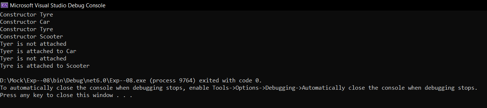

# Inheritance

## Aim:
To write a C# program to print some messages using hierarchical inheritance.
## Algorithm:
### Step 1:
Create a base class.

### Step 2:
Create two child class.

### Step 3:
Create a constructor in the base class and print a message.

### Step 4:
create a function in child class to print a message.

## Program:
```
using System;
namespace HelloWorld
{
    public class Tyer
    {
        public Tyer()
        {
            Console.WriteLine("Constructor Tyre");
        }
        public virtual void display()
        {
            Console.WriteLine("Tyer is not attached");
        }
    }
    class scooter : Tyer
    {
        public scooter()
        {
            Console.WriteLine("Constructor Scooter");
        }
        public override void display()
        {
            base.display();
            Console.WriteLine("Tyre is attached to Scooter");
        }
    }
    public class car : Tyer
    {
        public car()
        {
            Console.WriteLine("Constructor Car");
        }
        public override void display()
        {
            base.display();
            Console.WriteLine("Tyer is attached to Car");
        }
    }
    public class program
    {
        public static void Main(string[] args)
        {
            car car = new car();
            scooter scooter = new scooter();
            car.display();
            scooter.display();
        }
    }
}
```

## Output:


## Result
Thus a C# program to print some messages using hierarchical inheritance has implemented successfully

